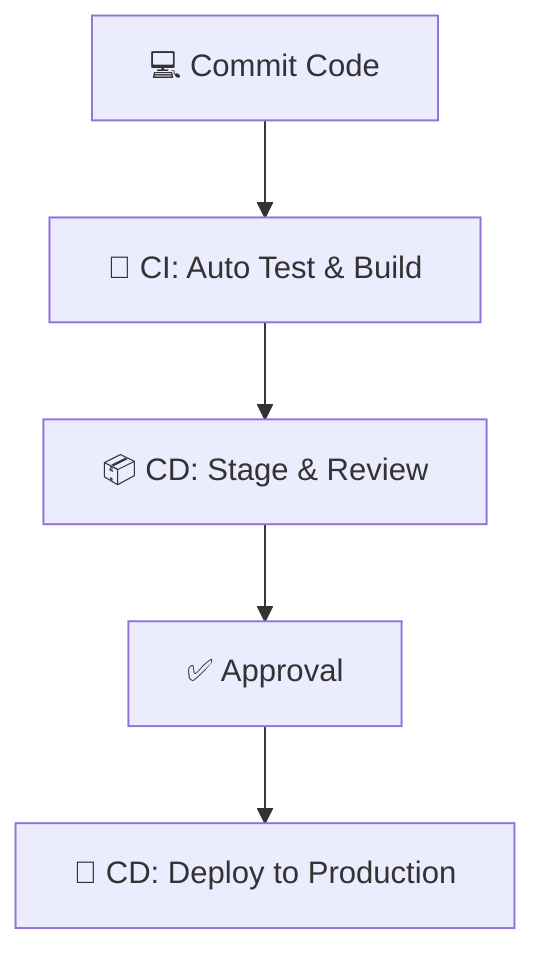

# 🧩🌟 DevOps: _The Bridge Between Realms~_

_“Where devs cast spells and ops summon them to life—in perfect harmony.”_ 🧙‍♂️✨

---

## 🪞 What is DevOps?

🔹 A **culture + practice** that unites **Development** 🧑‍💻 and **Operations** 🛠️.  
🔹 Breaks barriers, boosts collaboration, and enhances speed~ 💨  
🔹 Focused on **automation**, **continuous delivery**, and **improvement**! 🔁🌱

> 🧠 _Think of it as an enchanted cycle where every spell (feature) is tested, summoned, and watched over._ 💖

---

## 🔄 DevOps Lifecycle – _The Arcane Loop of Creation~_

| 🌸 Phase     | 🔧 Magical Tools                    | 🌟 Description                         |
| ------------ | ----------------------------------- | -------------------------------------- |
| 💡 Plan      | Jira, Trello, Confluence            | Quest planning, story mapping 📜       |
| 👩‍💻 Develop   | Git, GitHub, Bitbucket, VS Code     | Spell crafting with version control 🔮 |
| 🏗️ Build     | Maven, Gradle, ANT                  | Forge the artifacts from code~ 🧱      |
| 🧪 Test      | Selenium, JUnit, TestNG             | Ensure no backfiring spells 😵         |
| 🔁 Integrate | Jenkins, CircleCI, Travis CI        | Merging magic in harmony ⚗️            |
| 📦 Deploy    | Docker, Kubernetes, Ansible, Chef   | Ship your magic to the world 🚢        |
| ⚙️ Operate   | Terraform, Vagrant, Kubernetes      | Manage your summoning circle 🌐        |
| 📈 Monitor   | Prometheus, Grafana, Nagios, Splunk | Keep an eye on your realm 🧿           |

📝 **TL;DR**: DevOps is continuous, collaborative, and coded with care~ 💗

---

## 🌀 CI/CD: _The Eternal DevOps Spell Loop~_



🟢 **CI (Continuous Integration)**:  
💫 Code → Test → Integrate — all done _frequently_ and _automagically~_

🟨 **CD (Delivery)**:  
📦 Artifacts are always ready for summoning ✨

🟥 **CD (Deployment)**:  
🎯 _Automatic_ release to production—no sorcery delays~!

---

## 🐳 Docker: _The Mage’s Traveling Chest~_

- ✍️ **Dockerfile** – Blueprint for building magical containers
- 📸 **Image** – A snapshot of your spell
- 📦 **Container** – A living, breathing construct! 🪄
- 🌐 **Docker Hub** – A global chest for sharing containers~

🧪 Jenkins can auto-test these containers after each change~ ❤️

---

## 📘 DevOps Pipeline – _A Day in the Spellforge~_

```plaintext
1. 🧙 Git        → Pull code from sacred scrolls
2. 🧱 Maven      → Compile spells into artifacts
3. 🧪 Jenkins    → Test spells with Selenium & friends
4. 🍳 Ansible    → Prepare the environment (summoning altar)
5. 🚀 Deploy     → Let the magic live!
```

✨ _All of this happens in a beautiful, continuous loop of improvement~_ 🌀

---

## 🏰 Waterfall Model – _The Classic Royal Spellbook~_

🔸 A **linear path**—once you flip to the next page, you can't go back!  
Best when all requirements are **known upfront** 🏯

| Phase             | Summary                               |
| ----------------- | ------------------------------------- |
| 📝 Requirements   | Understand what the realm needs~      |
| 🏗️ Design         | Draw your magical architecture        |
| 💻 Implementation | Write the spell (code)                |
| 🧪 Testing        | Test it thoroughly!                   |
| 🚀 Deployment     | Release to users                      |
| ⚙️ Maintenance    | Keep your spell polished and patched~ |

✔️ Good for regulated, stable projects  
❌ Not great for changing quests mid-journey 😣

---

## 🌀 Agile Model – _The Living Grimoire~_

✨ Adaptive, flexible, and user-driven~

🔹 Emphasizes **iterative progress**, **teamwork**, and **frequent feedback**  
🔸 You _can_ change quests mid-sprint if the kingdom demands~ 😆

| Concept     | Description                         |
| ----------- | ----------------------------------- |
| 🏃 Sprints  | 1–4 week dev cycles                 |
| 🗣️ Standups | Daily syncs to update your party 🎮 |
| 📜 Backlog  | Feature list in priority order      |
| ✉️ Feedback | Clients help steer the journey~     |

🍰 Scrum and 🧃 Kanban are your trusty frameworks!

✔️ Perfect for fast-moving, ever-evolving stories  
❗ Requires high trust and collaboration 🤝

---

## 🎀 Final Scroll Recap – _Which Model is Right for You?_ 💖

| 🌟 Model     | 🔁 Flow Style | ✨ Flexibility | 🧙‍♀️ Best For                          |
| ------------ | ------------- | -------------- | ------------------------------------ |
| Waterfall 🏰 | Linear        | ❌ Rigid       | Projects with fixed royal decrees~   |
| Agile 🌀     | Iterative     | ✔️ High        | Ever-changing magical quests~        |
| DevOps ♻️    | Continuous    | ✔️ Super High  | Full-cycle, automation-heavy realms~ |
